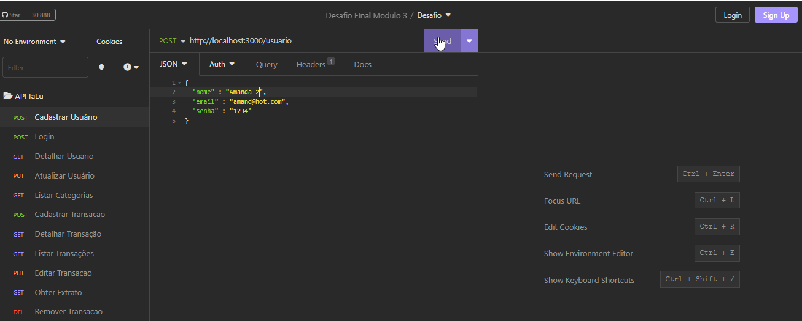
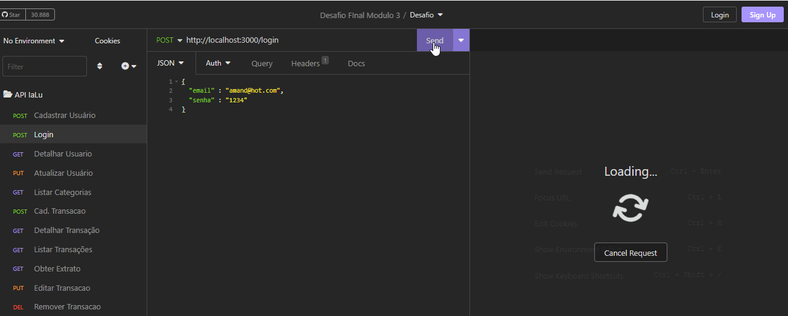
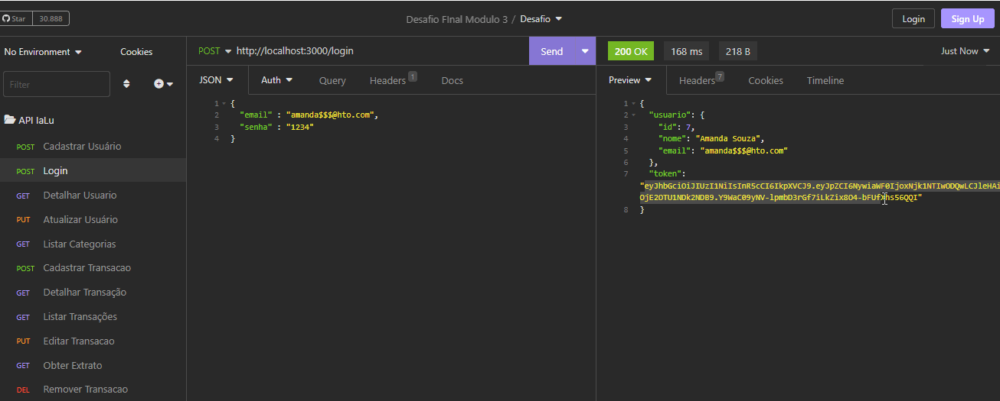
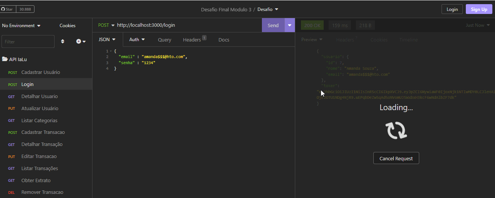
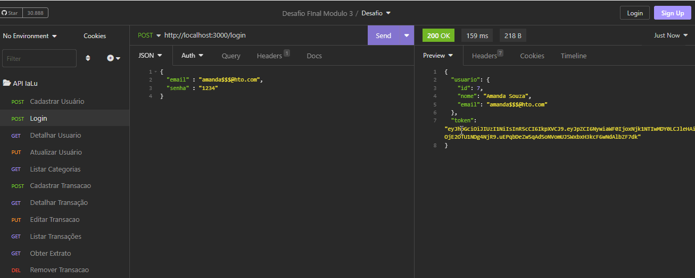
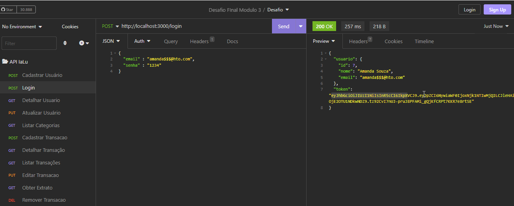
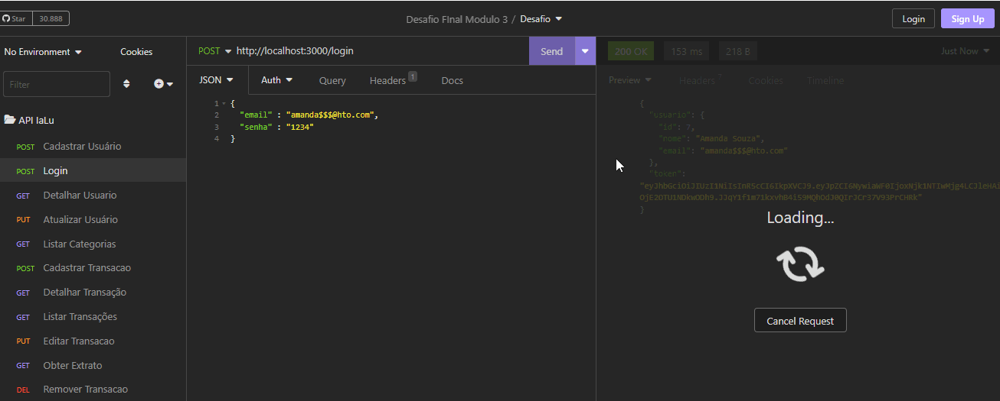
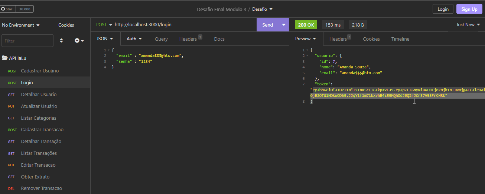

# Desafio Módulo 3 - Backend - Iara e Luelen

## Habilidades Técnicas Desenvolvida no Projeto 🤝

- criação de rotas usando status code
- validação de dados e requisições
- criação de banco de dados PostGrees
- manipulação de informações no banco de dados
- criptografia de senha antes de armazer no banco de dados
- verificação de token de autenticação
- instalação de frameworks e dependências
- uso de ferramentas como Insomnia, BeeKeeper e Discord
- organização e trabalho em equipe
- comunicação interpessoal através de dailys diárias para alinhamento do projeto
  
## Funcionalidades da Api RESTful 🛠

- Cadastrar Usuário

  
- Fazer Login

  
- Detalhar Perfil do Usuário Logado

  
- Editar Perfil do Usuário Logado

  
- Listar categorias

  
- Listar transações

  
- Detalhar transação

  
- Cadastrar transação

  
- Editar transação

  
- Remover transação

- Obter extrato de transações

  
- [Extra] Filtrar transações por categoria

## Como executar o projeto 🗂️

### Pré-requisitos

Você vai precisar ter instalado em sua máquina as seguintes ferramentas:

- Git
- Node.js
- VSCode ou outro editor
  
*Para trabalhar com o projeto você deverá seguir os seguintes passos*:

- Clone este repositório
- Instale as dependências com o comando `npm install`
- Certifique-se de ter um cliente de banco de dados PostgreSQL instalado em seu sistema. Você pode baixar e instalar o PostgreSQL a partir do [site oficial](https://www.postgresql.org/download/)
- Escolha um cliente de banco de dados PostgreSQL, sugerimos o  [Beekeeper Studio](https://www.beekeeperstudio.io/)
- Crie o banco de dados a partir do arquivo de despejo (dump)
- Execute a aplicação em modo de desenvolvimento
- O servidor inciará na porta:*3000*

## **Banco de dados**

###### tags: `back-end` `módulo 3` `nodeJS` `PostgreSQL` `API REST` `desafio`
